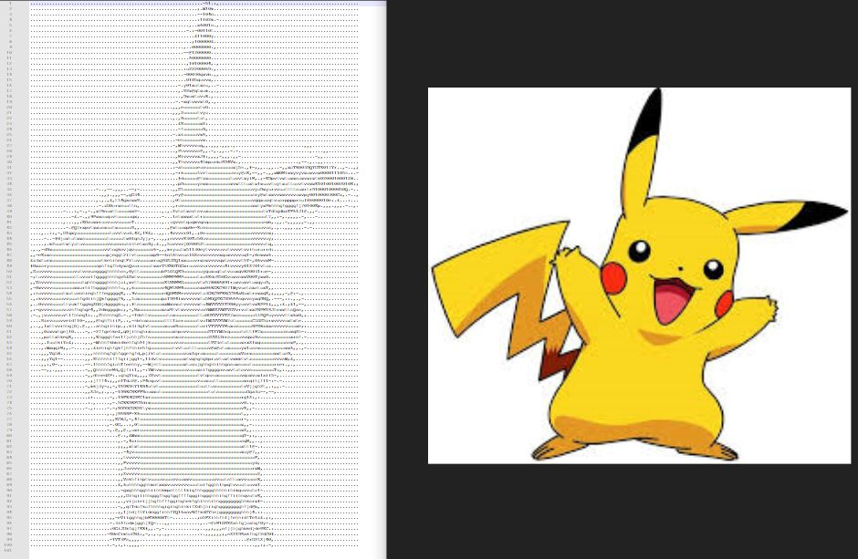
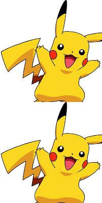
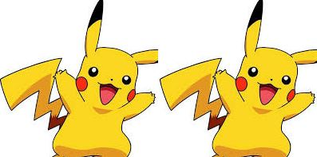

# Color to word
### Search mask info output for UNET by dark picture.
- run ```python color2word.py p1.jpg -o output.txt  --width 120 --height 100``` 
#### Parameter:
- p1.jpg for input image
- -o output_file_name
- --width output_width for word
- --height output_height for word
### Results


# CV2 image split and Merage
### Use in the split of image, or re-merage of new picture.
- run ```python cv2_split&Merage.py``` 
- Get data block from input image.
- Step2: Concat block of image by horizontal or vertical.
### Results



